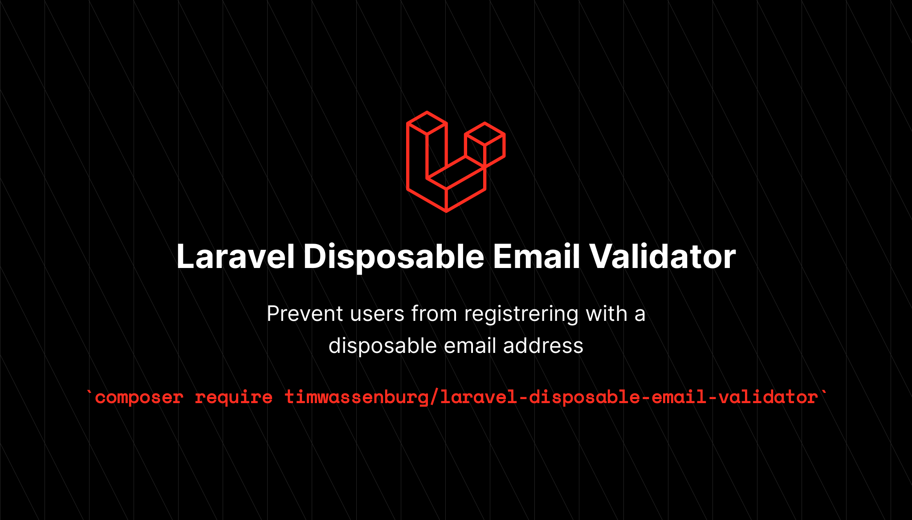

[](https://packagist.org/packages/timwassenburg/laravel-disposable-email-validator)
[](https://packagist.org/packages/timwassenburg/laravel-disposable-email-validator)
[](https://packagist.org/packages/timwassenburg/laravel-disposable-email-validator)

<hr>

## Table of Contents
  <ol>
    <li><a href="#installation">Installation</a></li>
    <li><a href="#usage">Usage</a></li>
    <li><a href="#translations">Translations</a></li>
    <li><a href="#adding-more-disposable-email-domains">Adding more disposable email domains</a></li>
    <li><a href="#caching">Caching</a></li>
    <li><a href="#contributing">Contributing</a></li>
    <li><a href="#license">License</a></li>
  </ol>

## Installation
Run composer require to install the package.
```bash
composer require timwassenburg/laravel-disposable-email-validator
```

## Usage
Add the disposable-email rule to input you want to check. 
Keep in mind that the ```disposable-email``` rule doesn't check if the email is valid so it is recommended
to use it in combination with the ```email``` validation rule.

```php
'email' => 'required|email|disposable-email'
```

## Translations
Publish the translations with the following command.
```bash
php artisan vendor:publish --provider="TimWassenburg\DisposableEmailValidator\DisposableEmailServiceProvider" --tag="translations"
```
You can now add or update translations in the ```resources/lang/vendor/disposable-email``` folder.

## Adding more disposable email domains
The config contains all domains the validator is checking, 
you can publish the config and extend the list by adding more domains.
```bash
php artisan vendor:publish --provider="TimWassenburg\DisposableEmailValidator\DisposableEmailServiceProvider" --tag="config"
```

## Caching
Although this might be obvious, just a small reminder. The list of disposable emails is loaded from a config file. For a production environment it is recommended to cache the
config for optimal performance. You can use the default Laravel config caching for this.

```bash
php artisan config:cache
```

## Contributing
Contributions are what make the open source community such an amazing place to learn, inspire, and create. Any contributions you make are **greatly appreciated**.

If you have a suggestion that would make this better, please fork the repo and create a pull request. You can also simply open an issue with the tag "enhancement".
Don't forget to give the project a star! Thanks again!

1. Fork the Project
2. Create your Feature Branch (`git checkout -b feature/AmazingFeature`)
3. Commit your Changes (`git commit -m 'Add some AmazingFeature'`)
4. Push to the Branch (`git push origin feature/AmazingFeature`)
5. Open a Pull Request

## License
The MIT License (MIT). Please see [License File](LICENSE.md) for more information.
